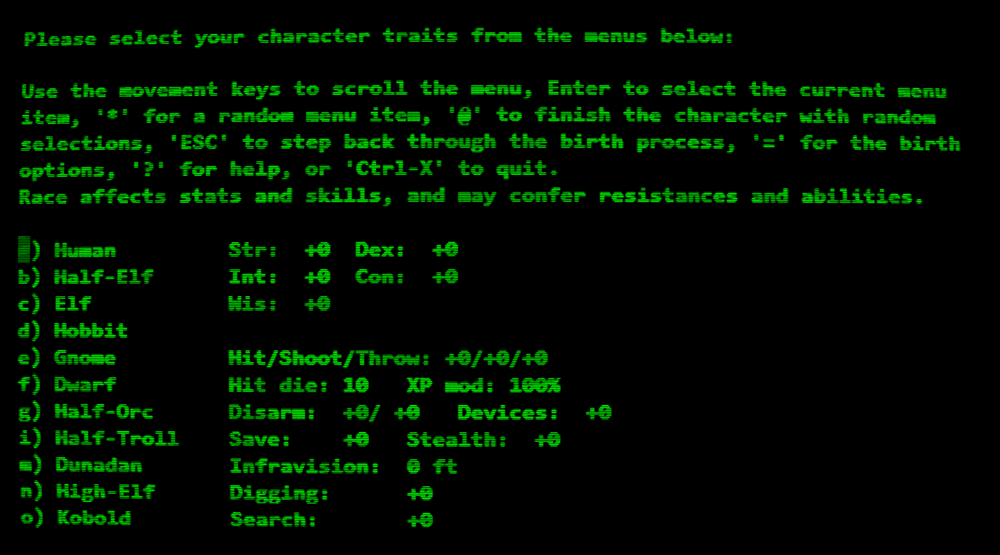

# CoolPyTerm

A hardware-accelerated SSH terminal emulator with authentic retro CRT effects, built with PyQt6 and OpenGL.



## ✨ Features

### 🔌 Advanced SSH Connection Management
- **Connection Profiles**: Save, organize, and manage multiple SSH connections
- **Recent Connections**: Quick access to recently used connections (marked with ⭐)
- **Authentication Support**: Password and SSH key authentication
- **Connection Dialog**: Enhanced UI with password fields and key file browser
- **Profile Management**: Create, edit, and delete connection profiles

### 🖥️ Hardware-Accelerated Terminal
- **OpenGL Rendering**: Smooth, hardware-accelerated text rendering
- **Full Screen Support**: Immersive full-screen terminal experience
- **Dynamic Resizing**: Automatic terminal resizing with proper PTY handling
- **Character Grid**: Efficient grid-based text rendering system

### 🎨 Authentic CRT Effects
- **Phosphor Glow**: Realistic phosphor afterglow effects
- **Scanlines**: Adjustable CRT scanline simulation
- **Screen Curvature**: Subtle barrel distortion for authenticity
- **Ambient Background Glow**: Subtle phosphor illumination across the screen
- **Brightness & Contrast**: Adjustable CRT-style image controls
- **Auto-DPI Scaling**: Automatic effect adjustment based on screen resolution

### 🎭 Retro Themes
- **Green Phosphor**: Classic green monochrome CRT terminal
- **Amber Phosphor**: Warm amber terminal with enhanced glow
- **DOS Terminal**: Retro blue DOS-style terminal

### ⌨️ Terminal Features
- **Full ANSI Support**: Complete terminal emulation with color support
- **Scrollback Buffer**: History navigation and scrolling
- **Cursor Control**: Blinking cursor with adjustable rate
- **Key Mapping**: Comprehensive SSH key handling
- **Clipboard Support**: Copy/paste functionality

## 🚀 Installation

### Prerequisites
- Python 3.10+
- PyQt6
- PyOpenGL (for hardware acceleration)
- SSH client libraries

### Install Dependencies
```bash
pip install -r requirements.txt
```

### Required Packages
```
PyQt6
PyOpenGL
PyOpenGL_accelerate
paramiko
pyte
numpy
```

## 🎮 Usage

### Starting the Application
```bash
python -m coolpyterm.cpt
```

### First Run
1. **Connection Dialog**: The application starts with a connection dialog
2. **Enter SSH Details**: Hostname, username, password/key file
3. **Save Profile**: Optionally save connection details for future use
4. **Connect**: Click "Connect" to establish SSH session

### Connection Management
- **Ctrl+M**: Open connection manager
- **Ctrl+N**: Create new connection
- **Double-click**: Connect to saved profile instantly

## ⌨️ Keyboard Shortcuts

### Application Controls
- **Ctrl+Alt+F11**: Toggle full screen mode
- **Ctrl+Q**: Quit application
- **Ctrl+V**: Paste from clipboard
- **Escape**: Exit full screen (in full screen mode)

### Visual Effects
- **Ctrl+G**: Toggle phosphor glow
- **Ctrl+S**: Toggle scanlines
- **Ctrl+Shift+A**: Toggle ambient background glow
- **Ctrl+Alt+I**: Increase ambient glow intensity
- **Ctrl+Alt+O**: Decrease ambient glow intensity

### Terminal Controls
- **Standard SSH keys**: All standard terminal key combinations work
- **Function keys**: F1-F12 support
- **Arrow keys**: Navigation support
- **Ctrl+C**: Send SIGINT
- **Ctrl+D**: Send EOF
- **Ctrl+Z**: Send SIGTSTP

## 🎨 Themes

### Green Phosphor (Default)
Classic green monochrome CRT appearance with moderate phosphor persistence and subtle background glow.

### Amber Phosphor  
Warm amber coloring reminiscent of early computer terminals, with enhanced background glow for that cozy retro feel.

### DOS Terminal
Blue-tinted terminal mimicking classic DOS and early PC interfaces with crisp, high-contrast appearance.

## ⚙️ Configuration

### Settings
- Connection profiles are automatically saved
- Window geometry and state persistence
- Theme preferences
- Effect intensity settings

### Auto-Adjustment Features
- **Scanline DPI Scaling**: Automatically adjusts scanline intensity based on screen DPI
- **Font Scaling**: Responsive font sizing
- **Effect Optimization**: Performance-optimized rendering

## 🔧 Advanced Features

### Full Screen Mode
- **Borderless Display**: True full screen experience
- **Menu-Free Interface**: Clean, distraction-free terminal
- **Proper Geometry**: Exact screen coverage
- **Easy Exit**: Escape key or Ctrl+Alt+F11

### CRT Authenticity
- **Phosphor Persistence**: Realistic afterglow simulation
- **Variable Intensity**: Adjustable effect levels
- **Theme Integration**: Effects tailored to each theme
- **Hardware Acceleration**: Smooth 60fps rendering

### Connection Features
- **Recent History**: Track and prioritize recent connections
- **Profile Export/Import**: (Planned feature)
- **Connection Validation**: Pre-connection testing
- **Error Handling**: Graceful connection failure management

## 🛠️ Development

### Project Structure
```
coolpyterm/
├── cpt.py                    # Main application entry point
├── connection_manager.py     # SSH connection management
├── opengl_grid_widget.py    # Hardware-accelerated rendering
├── retro_theme_manager.py   # Theme system
├── ssh_backend.py           # SSH connection handling
├── key_handler_ssh.py       # Keyboard input processing
├── settings_manager.py      # Configuration management
└── logs/                    # Application logs
```

### Key Components
- **OpenGL Shaders**: Custom fragment shaders for CRT effects
- **SSH Backend**: Paramiko-based SSH client
- **Grid Rendering**: Efficient character grid system
- **Theme Engine**: Extensible color scheme system

## 📋 System Requirements

### Minimum Requirements
- **OS**: Windows 10, macOS 10.14, or Linux
- **Python**: 3.8 or higher
- **Memory**: 512MB RAM
- **Graphics**: OpenGL 3.3 support

### Recommended
- **Graphics**: Dedicated GPU for best performance
- **Display**: High DPI display for optimal scanline effects
- **Memory**: 1GB+ RAM for large scrollback buffers

## 🐛 Troubleshooting

### OpenGL Issues
```bash
# Check OpenGL support
python -m coolpyterm.checkogl
```

### Connection Problems
- Verify SSH credentials
- Check network connectivity
- Review connection logs in `logs/` directory

### Performance Issues
- Disable effects on slower systems
- Reduce font size for better performance
- Use windowed mode instead of full screen

## 🤝 Contributing

1. Fork the repository
2. Create a feature branch
3. Make your changes
4. Add tests if applicable
5. Submit a pull request

## 📜 License

[Add your license information here]

## 🏆 Acknowledgments

- **PyQt6**: For the excellent GUI framework
- **OpenGL**: For hardware acceleration capabilities
- **Paramiko**: For robust SSH connectivity
- **Pyte**: For terminal emulation support


---

**CoolPyTerm** - Where modern technology meets retro aesthetics. Experience the nostalgia of classic terminals with the power of contemporary hardware acceleration.